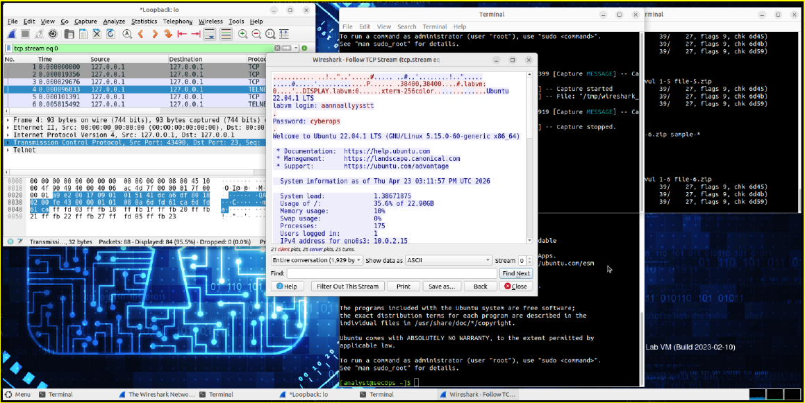
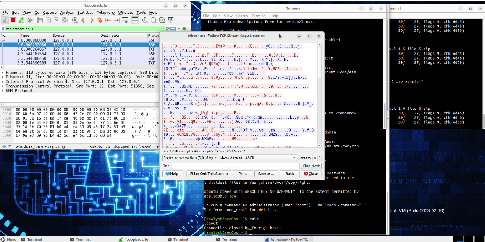

# Wireshark Lab: Examining Telnet and SSH

## Goal
Demonstrate the security differences between Telnet and SSH by capturing and analyzing both types of remote sessions in Wireshark.

This lab highlights why SSH is preferred for secure remote administration.

## Tools Used
- Security Workstation VM
- Wireshark
- Telnet client
- SSH client

## What I Did
- Started Wireshark and captured traffic on the loopback (`lo`) interface
- Opened a Telnet session to `localhost` and logged in
- Stopped the capture and used **Follow > TCP Stream** to review Telnet traffic
- Observed that the Telnet session, including credentials, appeared in plaintext
- Started a new Wireshark capture
- Opened an SSH session to `localhost`, accepted the host key, and logged in
- Stopped the capture and again used **Follow > TCP Stream**
- Observed that SSH traffic was encrypted and unreadable

## What I Observed

### Telnet
Wireshark displayed the Telnet session in plaintext, including:
- Username
- Password
- Terminal output

The TCP stream was fully readable, confirming that Telnet does not encrypt transmitted data.

### SSH
Wireshark showed:
- SSH version exchange
- Key exchange information
- Encrypted payload data

The TCP stream was unreadable, and no credentials or commands were visible, demonstrating that SSH protects session data through encryption.

## Why It Matters
Telnet sends data in plaintext, which makes it vulnerable to:
- Credential theft
- Packet sniffing
- Session interception

SSH encrypts remote session data, including usernames, passwords, commands, and output. This is why SSH is preferred over Telnet for secure administration.

In a SOC or cybersecurity role, understanding this difference matters because:
- Analysts need to identify insecure protocols on a network
- Plaintext protocols create unnecessary risk
- Secure remote administration is a basic security best practice

## Key Takeaway
This lab reinforced a core security principle: **Telnet exposes sensitive data, while SSH protects it through encryption.**

## Screenshots

### Telnet Session in Wireshark

### SSH Session in Wireshark

